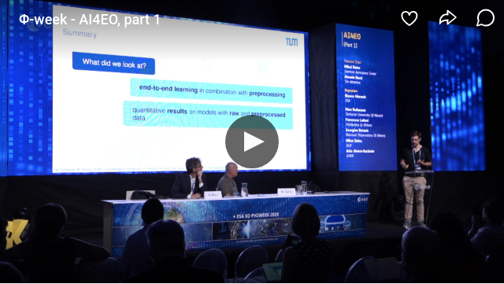

# Cloud-Robust Classification of Remote Sensing Time Series presentation at Phiweek 2019

Marc Rußwurm & Marco Körner,
Chair of Remote Sensing Technology
Technical University of Munich

#### This repositotry contains qualitative examples of inference for Satellite Time Series classification for crop type identification.

For the Transformer examples see `Transformer.ipynb`
[](https://colab.research.google.com/github/MarcCoru/phiweek19/blob/master/Transformer.ipynb)

For the Recurrence examples see `Recurrence.ipynb`
[](https://colab.research.google.com/github/MarcCoru/phiweek19/blob/master/Recurrence.ipynb)

#### Presentation

Slides are available at `presentation.pdf`

### Setup

```
conda create -n phiweek19 pip jupyter
conda activate phiweek19
pip install -r requirements.txt
```

### Presentaiton Recording
starts 23m30s

[](https://livestream.com/ESA/PhiWeek2019/videos/196081553)

### Dataset separation

To address the bias-varance question, we provide additional information on model training and model selection.

This repository shows Results from the testset (orange) of the HOLL region in northern Bavaria.
The model parameter were determined based on the training dataset. The hyperparameters were determined based on the performance on a 10% hold-back set from the trainset while training on the 90% of the remaining training dataset.

##### The regions Holl and Krum in Bavaria


##### Testset (orange) and Trainset (blue) of the Holl region


##### Testset (orange) and Trainset (blue) of the KRUM region


#### Self-Attention Mechanism on Testset in Holl Region


#### Self-Attention Mechanism on Testset in Krum Region

